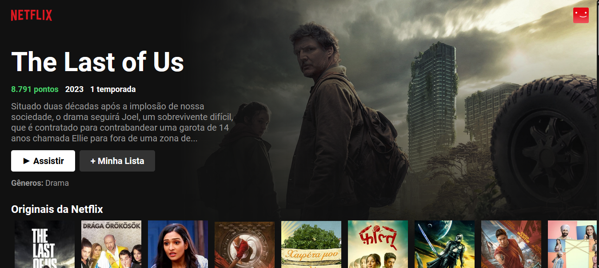

  <h1 >🎥 Welcome to Netflix CLone!</h1>

 

  

 

The Clone Netflix Project is a responsive web application that mimics the Netflix user interface, displaying movie posters on the home screen. It is built using React.js, CSS and Material UI library.

## Features

- **Responsive Design:** The layout adapts to different screen sizes for a seamless user experience on various devices.
- **Movie Posters:** The home screen displays a collection of movie posters similar to the Netflix interface.
